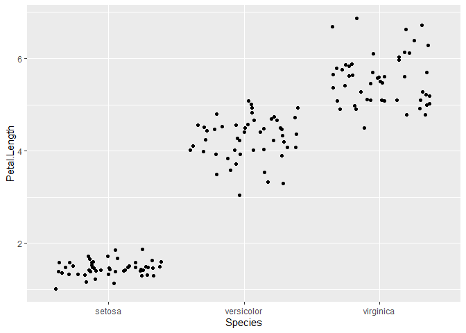
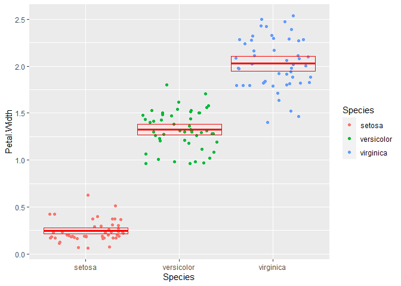

Lab 5 Assignment
================
Lara Al Selim
2021-02-23

``` r
library(tidyverse)
iris <- as_tibble(iris) # so it prints a little nicer
```

## QUESTION ONE

Rename each variable so that it is all lower-case and uses an underscore
\_ instead of a period . in the name (the recommended coding style in
the tidyverse style guide). Print the resulting table.

``` r
rename(
  iris,
  sepal_length = Sepal.Length,
  sepal_width = Sepal.Width,
  petal_length = Petal.Length,
  petal_width = Petal.Width
)
```

    ## # A tibble: 150 x 5
    ##    sepal_length sepal_width petal_length petal_width Species
    ##           <dbl>       <dbl>        <dbl>       <dbl> <fct>  
    ##  1          5.1         3.5          1.4         0.2 setosa 
    ##  2          4.9         3            1.4         0.2 setosa 
    ##  3          4.7         3.2          1.3         0.2 setosa 
    ##  4          4.6         3.1          1.5         0.2 setosa 
    ##  5          5           3.6          1.4         0.2 setosa 
    ##  6          5.4         3.9          1.7         0.4 setosa 
    ##  7          4.6         3.4          1.4         0.3 setosa 
    ##  8          5           3.4          1.5         0.2 setosa 
    ##  9          4.4         2.9          1.4         0.2 setosa 
    ## 10          4.9         3.1          1.5         0.1 setosa 
    ## # ... with 140 more rows

## QUESTION TWO

Convert the four numerical variables from cm to mm by multiplying by 10.
Print the resulting table.

``` r
mutate(
  iris,
  Sepal.Length = Sepal.Length * 10,
  Sepal.Width = Sepal.Width * 10,
  Petal.Length = Petal.Length * 10,
  Petal.Width = Petal.Width * 10
)
```

    ## # A tibble: 150 x 5
    ##    Sepal.Length Sepal.Width Petal.Length Petal.Width Species
    ##           <dbl>       <dbl>        <dbl>       <dbl> <fct>  
    ##  1           51          35           14           2 setosa 
    ##  2           49          30           14           2 setosa 
    ##  3           47          32           13           2 setosa 
    ##  4           46          31           15           2 setosa 
    ##  5           50          36           14           2 setosa 
    ##  6           54          39           17           4 setosa 
    ##  7           46          34           14           3 setosa 
    ##  8           50          34           15           2 setosa 
    ##  9           44          29           14           2 setosa 
    ## 10           49          31           15           1 setosa 
    ## # ... with 140 more rows

## QUESTION THREE

Calculate sepal area and petal area (area is equal to length multiplied
by width). Print a table with only the variables sepal area, petal area,
and species.

``` r
iris_area <- 
mutate(iris,
       Sepal_area = Sepal.Length * Sepal.Width,
       petal_area = Petal.Length * Petal.Width)
select(iris_area,Sepal_area,petal_area)
```

    ## # A tibble: 150 x 2
    ##    Sepal_area petal_area
    ##         <dbl>      <dbl>
    ##  1       17.8      0.280
    ##  2       14.7      0.280
    ##  3       15.0      0.26 
    ##  4       14.3      0.3  
    ##  5       18        0.280
    ##  6       21.1      0.68 
    ##  7       15.6      0.42 
    ##  8       17        0.3  
    ##  9       12.8      0.280
    ## 10       15.2      0.15 
    ## # ... with 140 more rows

## QUESTION FOUR

Calculate the following statistics for the entire dataset from the sepal
length variable and print the resulting table:

``` r
summarize(
  iris,
  sampl_size = n(),
  max = max(Sepal.Length),
  min = min(Sepal.Length),
  range = max-min,
  median = median(Sepal.Length),
  q1 = quantile(Sepal.Length, probs=0.25),
  q3 = quantile(Sepal.Length, probs=0.75),
  iqr = IQR(Sepal.Length)
)
```

    ## # A tibble: 1 x 8
    ##   sampl_size   max   min range median    q1    q3   iqr
    ##        <int> <dbl> <dbl> <dbl>  <dbl> <dbl> <dbl> <dbl>
    ## 1        150   7.9   4.3   3.6    5.8   5.1   6.4   1.3

## QUESTION FIVE

Calculate the following statistics for each species from the petal width
variable and print the resulting table:

``` r
iris_grouped <- group_by(iris,Species)
iris_grouped
```

    ## # A tibble: 150 x 5
    ## # Groups:   Species [3]
    ##    Sepal.Length Sepal.Width Petal.Length Petal.Width Species
    ##           <dbl>       <dbl>        <dbl>       <dbl> <fct>  
    ##  1          5.1         3.5          1.4         0.2 setosa 
    ##  2          4.9         3            1.4         0.2 setosa 
    ##  3          4.7         3.2          1.3         0.2 setosa 
    ##  4          4.6         3.1          1.5         0.2 setosa 
    ##  5          5           3.6          1.4         0.2 setosa 
    ##  6          5.4         3.9          1.7         0.4 setosa 
    ##  7          4.6         3.4          1.4         0.3 setosa 
    ##  8          5           3.4          1.5         0.2 setosa 
    ##  9          4.4         2.9          1.4         0.2 setosa 
    ## 10          4.9         3.1          1.5         0.1 setosa 
    ## # ... with 140 more rows

``` r
iris_summarised<-
summarise(
  iris_grouped,
  sample_size = n(),
  mean = mean(Petal.Width),
  sd = sd(Petal.Width),
  var = var(Petal.Width),
  stderr = sd / sqrt(sample_size),
  ci_upper = mean + 2 * stderr,
  ci_lower = mean - 2 * stderr
)
```

    ## `summarise()` ungrouping output (override with `.groups` argument)

``` r
iris_summarised
```

    ## # A tibble: 3 x 8
    ##   Species    sample_size  mean    sd    var stderr ci_upper ci_lower
    ##   <fct>            <int> <dbl> <dbl>  <dbl>  <dbl>    <dbl>    <dbl>
    ## 1 setosa              50 0.246 0.105 0.0111 0.0149    0.276    0.216
    ## 2 versicolor          50 1.33  0.198 0.0391 0.0280    1.38     1.27 
    ## 3 virginica           50 2.03  0.275 0.0754 0.0388    2.10     1.95

## QUESTION SIX

Visualize the relationship between petal width and species using a strip
plot.

``` r
ggplot(data=iris)+geom_jitter(aes(y=Petal.Length,x=Species))
```

<!-- -->

## QUESTION SEVEN

Starting with the previous graph, add the mean and 95% confidence
interval for each species

``` r
ggplot(data=iris)+geom_jitter(aes(y=Petal.Width,x=Species, color=Species)) +
geom_crossbar(
  data = iris_summarised, 
  mapping = aes(x = Species, y = mean, ymax = ci_upper, 
                ymin = ci_lower),
  color = "red"
)
```

<!-- -->

## QUESTION EIGHT

Visualize the relationship between petal length, petal width, and
species using a scatterplot. Map the two numerical variables to the x
and y axes and map species to the color and shape aesthetics.

``` r
ggplot(data = iris) +
  geom_point(mapping = aes(x = Petal.Length , y = Petal.Width, color = Species))
```

<!-- -->
